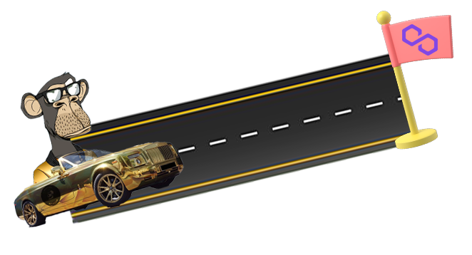

# 👋 Welcome

## Overview

With the start of the new wave of NFTs in the beginning of 2022, Friends who worked together for years in the hardships of programming, we saw the opportunity to grow NFTs on Polygon Blockchain.

&#x20;Because over the past few months, this blockchain has become a very suitable platform with its increasing growth for Solidity, EVM , programmers and attracted many users due to high network speed and low transaction fees.&#x20;

There was no doubt about the decision we had made. We wanted to provide a place for ourselves in Polygon blockchain , so we decided to bring the most famous NFT collection, BAYC, to Polygon, relying on our knowledge and innovation power, because everyone loves these famous monkeys. No Better way to start our adventure in Polygon.

<figure><figcaption></figcaption></figure>
