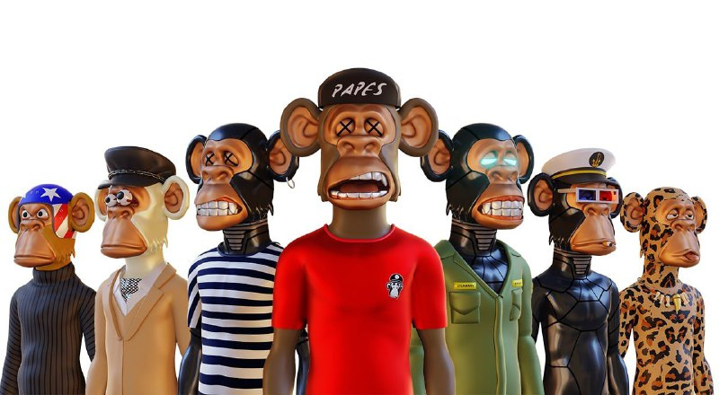

# 🔆 Big Update

Big update As we continued on our way, we were faced with the question, are we just a copycat project?

&#x20;But we had tried our best to build a healthy society and we had not given up until that moment despite all the problems. But this question was bothering us, we decided to answer this question from our desk, which had been bothering our team since the beginning of its activity, and the answer alone was not enough, we had to do something. We started making the first 3D monkeys in Polygon.

<figure><figcaption></figcaption></figure>

&#x20;After a survey and sharing of this concern and with the decision of the community, the supply of monkeys started. Everything had to change in order to get out of the shadow of being a copycat. We updated the website, designed a new logo, uploaded 10,000 3D monkeys to IPFS. Roadmap update Everything went great Another great success for the polygonapes team. We have proven that **we are not a copy project**.&#x20;

3D survey link [https://twitter.com/Polygonapes/status/1531499562564653056](https://twitter.com/Polygonapes/status/1531499562564653056)
