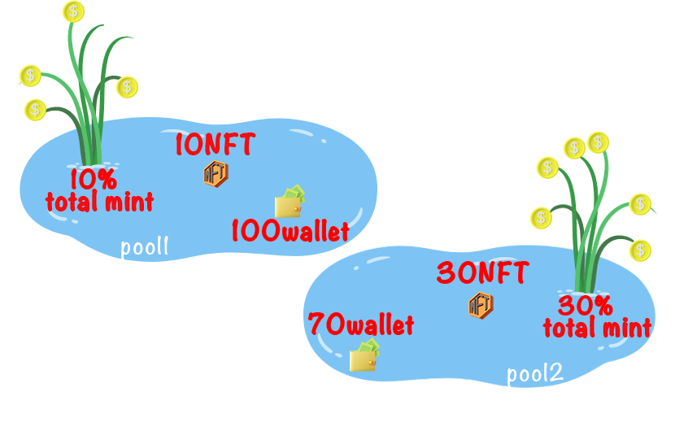

# 🏊♂ Pools & Earn

In order to involve the community in this new contract and encourage new users to join the community, we decided to deposit a percentage of mint in pools that will be divided among the members of those pools.

### Making money in the new version of Mint for the new collection:

the new contract has 2 types of pools with limited capacity. To become a member of these pools, you must have mined a certain amount to be able to enter that pool as follows

* The first pool with a capacity of 100 wallets and for people who have minted 10 NFTs and 10% of the total minted amount will enter this pool.
* The second pool with a capacity of 70 wallets for people who have minted 30 NFT and 20% of the total minted amount will enter this pool.
*

    <figure><figcaption></figcaption></figure>
