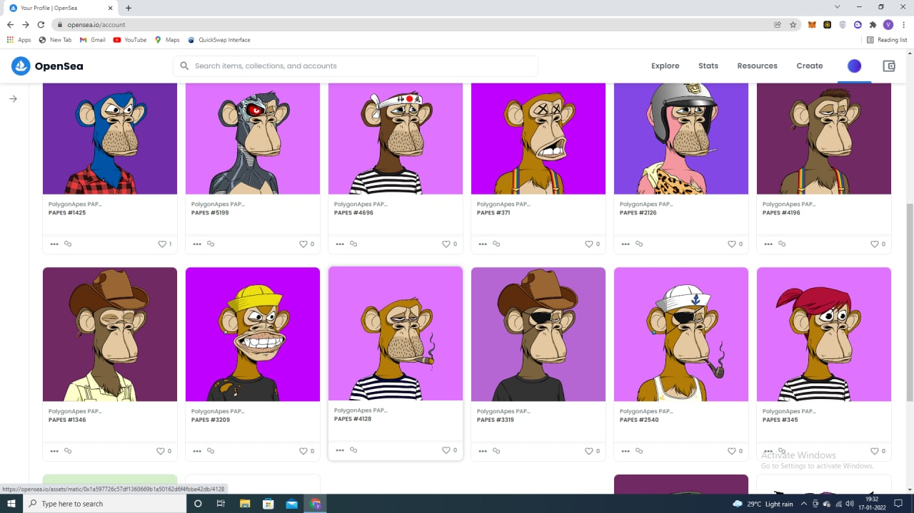

# 🎇 Publish on Opensea

But the polygonapes team continued with more strength. Publication in Opensea , one of the largest marketplaces available in the field of NFTs, which with the cooperation and support of the Polygon blockchain, are a suitable platform for buying and selling for polygonpaes holders.

On January 12, the polygonpaes page was officially launched in opensea. [https://twitter.com/Polygonapes/status/1481244098199793666](https://twitter.com/Polygonapes/status/1481244098199793666)\

<figure><figcaption></figcaption></figure>

&#x20;
