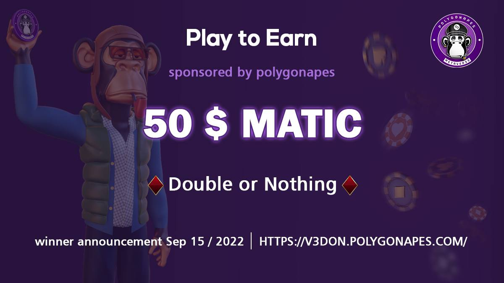

# 🌟 Staking

The start of work on the staking system began in early June and after many tests to increase the security of the contract, it was released in late July.&#x20;

The **staking** system was such that by staking your NFT in the contract, you get the profit of every transaction in the game, **nothing or double** It happens and you can take your NFT out of the stake mode whenever you like.&#x20;

<figure><figcaption></figcaption></figure>

To play **nothing or double** you had an equal chance of doubling your Matic or doubling it or losing to the pool, in this system you had a 50/50 chance of winning or losing.&#x20;

3 versions of the nothing or double game were released, which were very well received. More than 300 NFTs were staked in this system, which had a very positive effect on the value of NFTs in the market.
