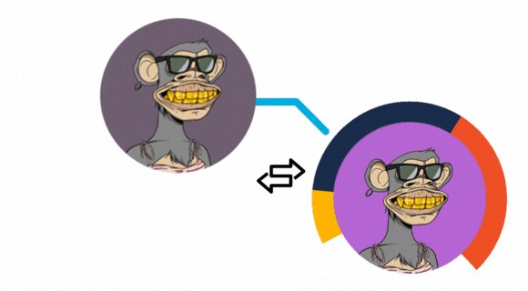

# 💡 What we do

After providing enough information about the Polygon community and collecting an amount to start marketing, we confidently started working on the contract and on January 2, 2022, we published the first tweet on the official Polygonapes account and introduced ourselves to the Polygon world.

At first, it was decided to present the original version of the BAYC collection and maintain its authenticity and refer to the original collection, with a few changes, including changing the background and synchronizing it with the Polygon environment, and focusing all our attention on the utility cases of NFT features so that we can build a better future in the path and road map ahead.&#x20;

<figure><figcaption></figcaption></figure>

From the very beginning, complaints were raised about the photos being copies, and some members of the community objected to the fact that the photos were copies, but because we were thinking of a bigger goal, we continued on our way along with the majority of the community.

&#x20;Several **giveaways & airdrops** were done in the course of the advertising campaign to attract interested people and we received a good response.

&#x20;We started partnerships and collaborations with more than **20 projects** and influencers along the way.
